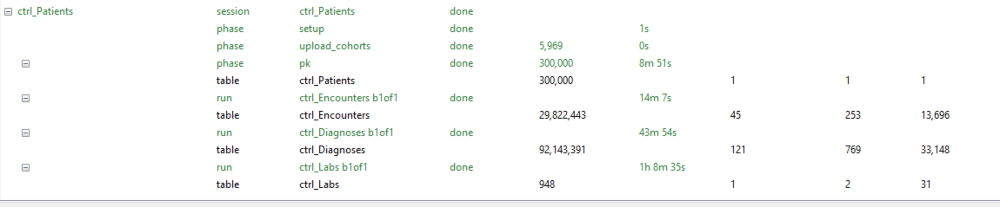

# Task list

File for discussing ideas and open questions. Your notes, then Claude's reply in a blue box and yours in an orange box (D22). Write anywhere inside your box, between its `:::` lines. New notes go above **Settled**; what is agreed moves there, then into the plan documents (`design.md`, `decisions.md`, `roadmap.md`) and is deleted from here (D1). Pasted images land in `images/` beside this file.

**Starting a new chat.** Paste this, with the section's heading filled in:

``` text
Work on the task list section "<heading>" in docs/plan/tasklist.md.
```

A new chat reads `.claude/CLAUDE.md` by itself, which sends it to the plan documents and tells it to answer here. The one rule that keeps it true: **anything that matters and was only said in a chat goes into this file before that chat ends**, under the section it belongs to.

## Next on the VM

What you asked for is built in `study/`: the script (`build_group_parquet.py`), its walkthrough (`README.md`), and the control pull (`pulls/ctrl_PheWAS_intake.yaml`). The tutorial is remade on the same files and columns. Your answers are in D29–D32.

::: {style="border:2px solid #4a90e2; border-radius:6px; padding:8px 12px; margin:8px 0;"}
**Claude: what to run, and what to send back**

1.  Copy `build_group_parquet.py` into the `hat_` pull's parquet folder and run `python build_group_parquet.py`. **Paste `hat_group_report.txt` here**: it lists every `DiagnosisStatus` and which were dropped (the script drops any containing "rule", "error", "delete" or "cancel"; the real spellings are unknown until now), the sex, race, ethnicity and encounter-status values, and who isn't eligible.
2.  Put the `hat_patient_keys.parquet` it writes beside `ctrl_PheWAS_intake.yaml`, check `project_db`, and run the pull. **Send back** how many rows `ctrl_Patients` got: under 300,000 means raising `pool_permille`.
3.  Run the script in the `ctrl_` parquet folder too, and paste `control_group_report.txt`.

Then matching and the PheWAS, as in `control-matching-tutorial.md`.
:::

::: {style="border:2px solid #e2904a; border-radius:6px; padding:8px 12px; margin:8px 0;"}
**Your response: Past this, update plan with information.** 
:::

## Three choices made while building

::: {style="border:2px solid #4a90e2; border-radius:6px; padding:8px 12px; margin:8px 0;"}
**Claude: in the code now, for you to confirm**

1.  **Cases indexed before 2021-10-01 aren't matched.** 134 of the 5,974 have their first D89.44 before the code existed (query 2): 15 before 2015, 119 from 2015 to 2021 Q3. The control pool starts at 2021-10-01 (D30), so exact-quarter matching has no controls for them, and their D89.44 was likely mapped after the fact. The script marks them (`IndexBeforeD8944Existed`) and makes them ineligible. **Recommend:** keep it so, and report them; widening the pool back to 2015 would roughly double the pool for 2% of cases.
2.  **Earlier mast-cell codes will show up as a PheWAS result.** Only D89.44 is dropped from the events, so the 1,523 cases with an earlier D89.40–D89.49 put phecode `BI_180.6` (Mast cell activation syndrome) into the pre-index window: partly the HaT workup itself (Attending Questions, question 1). **Recommend:** primary analysis drops D89.44 only, and reads `BI_180.6` as exposure-adjacent; a sensitivity analysis drops all of D89.40–D89.49 (`--exclude-codes D89.40 D89.41 D89.42 D89.43 D89.44 D89.49`).
3.  **Controls with a high tryptase are kept.** A control with a baseline tryptase above about 8 ng/mL may be undiagnosed HaT. The script records `TryptaseMax` for controls but doesn't drop anyone. **Recommend:** drop controls with `TryptaseMax` above 8 before matching; there should be very few, and it reduces misclassification of controls.

**For you to decide:** each of 1–3.
:::

::: {style="border:2px solid #e2904a; border-radius:6px; padding:8px 12px; margin:8px 0;"}
**Your response\
See if you can update based on our information.**

1.  

2.  

3.  
:::

## Suggested order

1.  **Next on the VM**: both groups are built (the control pull's numbers are in the roadmap). Paste `hat_group_report.txt` and `control_group_report.txt` here: they show whether the script's guesses (status spellings, units) fit the real data, and they hold the numbers the three choices need.
2.  **Three choices**: needed before matching.

# Settled

Nothing waiting.