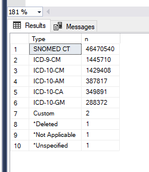
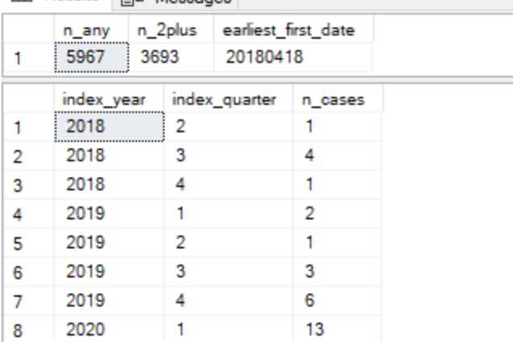
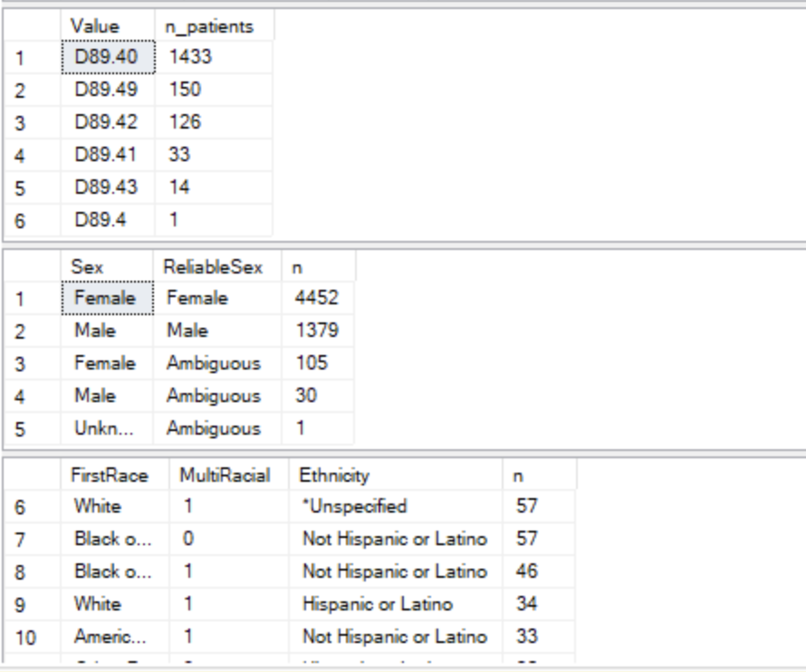
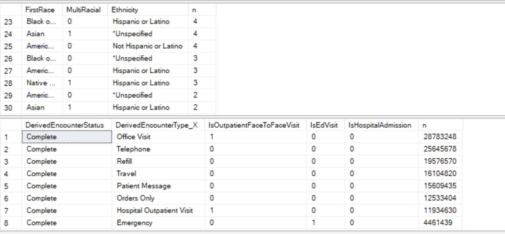

# Task list

File for discussing ideas and open questions. Your notes, then Claude's reply in a blue box and yours in an orange box (D22). Write anywhere inside your box, between its `:::` lines. New notes go above **Settled**; what is agreed moves there, then into the plan documents (`design.md`, `decisions.md`, `roadmap.md`) and is deleted from here (D1). Pasted images land in `images/` beside this file.

**Starting a new chat.** Paste this, with the section's heading filled in:

``` text
Work on the task list section "<heading>" in reference/plan/tasklist.md.
```

A new chat reads `.claude/CLAUDE.md` by itself, which sends it to the plan documents and tells it to answer here. The one rule that keeps it true: **anything that matters and was only said in a chat goes into this file before that chat ends**, under the section it belongs to.

## Profile query results

Queries in `profile_queries.sql`, run in SSMS. Query 6 is done: Cosmos spells it `ICD-10-CM` (and `ICD-9-CM`), now in D15.



1\) and maybe 2)



3,4,5





::: {style="border:2px solid #4a90e2; border-radius:6px; padding:8px 12px; margin:8px 0;"}
**Claude: what the results say** (2026-10-01)

Enough to act on, with two surprises.

1. **Cases: 3,693, not ~6,000.** 5,967 patients have any D89.44; 3,693 have it on 2+ dates. So 2,274 (38%) have a single D89.44: neither cases nor controls (D5). That's a large group; worth knowing who they are (a one-off code, or diagnosed late in the window with no time for a second code).
2. **D89.44 appears from April 2018**, not October 2021: the earliest first date was 20180418, and there are cases in every quarter from 2018 Q2. My October 2021 belief was wrong for Cosmos, likely because Cosmos maps older diagnoses to today's codes. And since query 1 only searched from 2018, some patients' *true* first D89.44 may be earlier still. **Query 7** (new) checks with no 2018 floor, one row per year.
3. **Other D89.4x before the first D89.44 is common:** D89.40 in 1,433 patients (about 24%), D89.49 in 150, D89.42 in 126, D89.41 in 33, D89.43 in 14. That's a large share, so the index date needs a second look (D4). **Query 8** (new) shows how long before: weeks (the same workup, recoded) or years (an earlier mast-cell diagnosis).
4. **Sex:** `ReliableSex` is Female 4,452, Male 1,379 and **Ambiguous 136** (where `Sex` says Female 105, Male 30, Unknown 1). **Race/ethnicity:** unknowns are spelled with a leading `*` (`*Unspecified`), so the rule can be "blank or starts with `*` → Unknown". The values were cut off in the screenshot; **query 9** (new) lists race and ethnicity separately, short enough to see whole.
5. **Encounters:** the completed status is `Complete`. But `IsOutpatientFaceToFaceVisit = 1` covers both **Office Visit** and **Hospital Outpatient Visit**, and the second can be labs, imaging or infusions. **Query 10** (new) lists every type with the flag.

**What this changes, for you to decide:**

- **The window: done (D23).** The pull now starts at 1990, so every patient's true first D89.44 is found and every case has 3 years of history; Python applies the lookback.
- **The index date (D4)**, once query 8 is in: keep the first D89.44, or use the first D89.4x when it came shortly before.
- **Sex:** my suggestion is `ReliableSex`, falling back to `Sex` for the 136 Ambiguous, and dropping the 1 Unknown.
- **Clinic visits:** Office Visit only, or anything flagged face-to-face. My suggestion is Office Visit only, pending query 10.

**Getting whole results out of SSMS:** click the grid, Ctrl+A, then right-click → **Copy with Headers**, and paste here as text. Or press Ctrl+T before running (Results to Text) and copy the text. Either is easier than screenshots for long results.
:::

::: {style="border:2px solid #e2904a; border-radius:6px; padding:8px 12px; margin:8px 0;"}
**Your response**

- Index date:
- Sex:
- Clinic visits:
- Queries 7–10:
:::

## Case count: 5,967 or 3,693

(From chat, 2026-10-01.) Your earlier dedup found about 6,000 HaT patients; query 1 says 3,693 cases. Papers may quote the 6,000.

::: {style="border:2px solid #4a90e2; border-radius:6px; padding:8px 12px; margin:8px 0;"}
**Claude: both numbers are right; they count different things**

- **5,967** is unique patients with **at least one** D89.44 (2018–2026). That matches your ~6,000, and query 4, which adds the PatientDim filters, also sums to 5,967. A paper saying "about 6,000 patients with a HaT diagnosis code" is accurate.
- **3,693** is those with D89.44 on **2 or more distinct dates**: the case rule we set for this study (D4). It's a design choice, borrowed from the PheWAS habit of requiring two codes so one-off or rule-out codes don't count. It isn't a fact about how many HaT patients exist.

I checked the query: it counts distinct patients and distinct dates, so duplicate rows (billing repeats, several terminology rows per diagnosis) can't inflate or shrink either number. Two things it can't rule out: patients whose D89.44 is only before 2018 (query 7 searches from 1990), and codes recorded under ICD-10-AM/-CA rather than -CM (unlikely for a US code).

**Worth reconsidering the 2-date rule for HaT.** HaT is diagnosed by a genetic test (tryptase genotyping), so a single D89.44 is probably more specific than a single code for a common condition, where the rule matters most. Two options:

- **1+ D89.44 as the primary definition** (5,967 cases, more power), with 2+ dates as a sensitivity analysis.
- **Keep 2+ dates** (3,693), with 1+ as the sensitivity analysis.

**Query 11** (new) breaks the 5,967 down by number of D89.44 dates. It also shows how many single-date patients were coded only in the last 6 months (no time for a second code) or only on a problem list. That tells us whether the single-date group looks like real HaT patients.

**For you to decide:** which definition is primary, once query 11 is in. Either way, a paper can report both numbers.
:::

::: {style="border:2px solid #e2904a; border-radius:6px; padding:8px 12px; margin:8px 0;"}
**Your response**
:::

## Precision

(Your note, 2026-10-01: "once done we'll talk through more of precision".)

::: {style="border:2px solid #4a90e2; border-radius:6px; padding:8px 12px; margin:8px 0;"}
**Claude: what to cover**

Not started. Say what you want to cover and I'll answer here: for example how many cases each phecode needs (pheauxWAS's `--min-cases 20`), the power at 4:1, or how tight the matching needs to be.
:::

::: {style="border:2px solid #e2904a; border-radius:6px; padding:8px 12px; margin:8px 0;"}
**Your response**
:::

## Older notes to fold in

`reference/cosmos_parquet_ref.yaml` and `Questions.md` predate the plan documents.

::: {style="border:2px solid #4a90e2; border-radius:6px; padding:8px 12px; margin:8px 0;"}
**Claude: retire or keep**

- **`cosmos_parquet_ref.yaml`** was the extraction plan. Every settled line in it is now in `design.md` (Derived Fields, The Cosmos Pull) or a decision, and the pull itself is `HaT_PheWAS_intake.yaml`. Keeping it means two places for one fact. **Recommend:** delete it.
- **`Questions.md`** is the control-pool discussion. Its conclusions are D6 (match on the chance to be observed, not phenotype), and its comparator ideas are in the roadmap's Open Problems. **Recommend:** delete it too, or keep it as a record if you prefer; git has it either way.

**For you to decide:** delete both, keep one, or keep both.
:::

::: {style="border:2px solid #e2904a; border-radius:6px; padding:8px 12px; margin:8px 0;"}
**Your response**
:::

## Suggested order

1.  **Case count**: it sets the cohort size and touches your papers; query 11 settles it.
2.  **Profile query results**: the window and index-date questions change the pull itself, so they come before running it (roadmap, Next 1–2).
3.  **Older notes**: quick, and stops facts living in two places.
4.  **Precision**: now more pressing with 3,693 cases instead of ~6,000, but it doesn't block the pull.

# Settled

Nothing waiting.